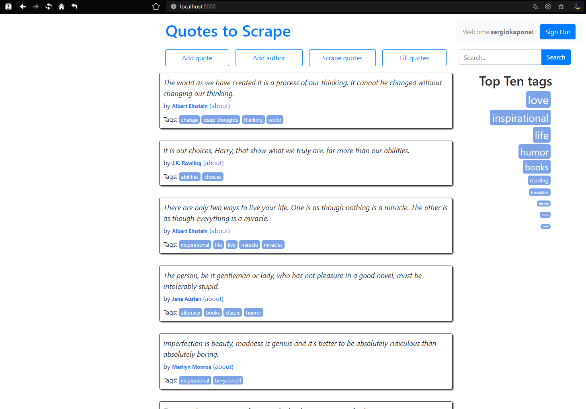
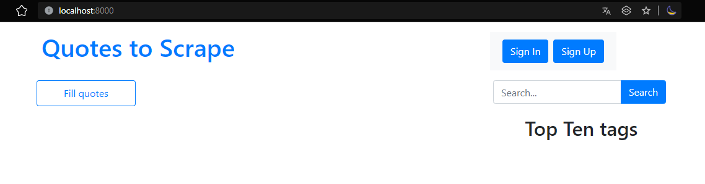
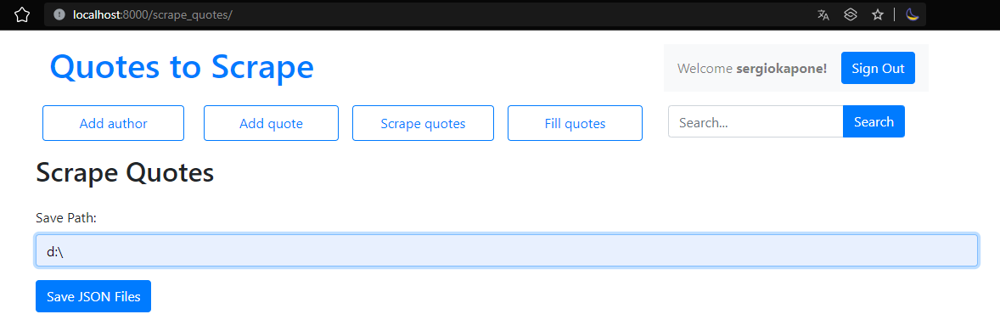

# Домашнє завдання #10    

Реалізація на Django аналогу сайту [Quotes to Scrape](http://quotes.toscrape.com/).

## Вигляд сайту



## Установка проекту

Для управління залежностями проекту використовується `pipenv`. Необхідно встановити `pipenv` перед виконанням наступних кроків:

- Склонируйте репозиторий:

  ```shell
  git clone https://github.com/sergiokapone/goit_python_web_hw10.git
  ```

- Для встановлення залежностей використайте команду `pipenv install` або `pipenv sync`.

## Структура проекту

```text
├── hw10\
│   ├── hw10\
│   │   ├── settings.py
│   │   ├── urls.py
│   │   └── wsgi.py
│   ├── quotes\
│   │   ├── migrations\
│   │   ├── static\
│   │   ├── templates\
│   │   └── templatetags\
│   ├── users\
│   │   ├── migrations\
│   │   ├── static\
│   │   ├── templates\
│   │   └── views.py
│   └── utils\
└── manage.py
```

## Установка бази даних

Відкрийте командний рядок або термінал та виконайте наступну команду:

```shell
docker run --name quotessite -p 5432:5432 -e POSTGRES_PASSWORD=54321 -e POSTGRES_DB=quotessite -d postgres
```

Ця команда створить контейнер з базою даних PostgreSQL з ім'ям `quotessite`. Опція `-p 5432:5432` прив'язує порт `5432` контейнера до порту `5432` на локальній машині, що дозволяє з'єднуватися з базою даних. Опції `-e POSTGRES_PASSWORD=54321` та `-e POSTGRES_DB=quotessite` встановлюють пароль доступу до бази даних та створюють порожню базу даних з назвою `quotessite`.

## Запуск проекту

Для запуску проекту Django виконайте наступні кроки:

1. Перейсдіть в папку `cd hw10`
2. Виконайте міграцію бази даних, виконавши наступну команду:

```shell
python manage.py migrate
```

3. Запустіть локальний веб-сервер Django, виконавши наступну команду:

```shell
python manage.py runserver
```

4. Після успішного запуску сервера, ви побачите повідомлення, що сервер працює та слухає на порті 8000:

```shell
Starting development server at http://127.0.0.1:8000/
Quit the server with CONTROL-C.
```

5. Відкрийте свій веб-браузер та перейдіть за адресою http://127.0.0.1:8000/. Ви повинні побачити ваш проект Django, який успішно запущений.

6. Для наповнення бази даних натисніть на сторінці `Fill quotes`. Через деякий час на сторінці з'являться цитати
   

## Функціональні кнопки

Після реєстрації користувача будуть доступні наступні функціональні кнопки

1. `Add Author` - форма для додавання автора в базу даних

2. `Add Quote` - форма для додавання цитати.
3. `Scrape quotes` - форма для збереження авторів та цитат з бази даних в файли

- `author.json`
- `quotes.json`

Для збереження, у вікні форми треба ввести шлях, куди зберігати файли і
натиснути кнопку `Save JSON files`



###

## Довідкові матеріали

1. https://django.fun/
2. https://docs.djangoproject.com/en/4.2/
3. https://proproprogs.ru/django
